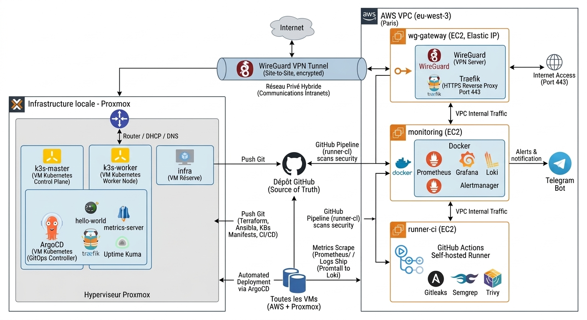

# 🧪 infra-lab

Lab DevOps hybride **Proxmox (local) + AWS (cloud)**, entièrement piloté en **Infrastructure as Code**.

<p>
  
  
  
  
  
  
  
  
  
  
  
  
  
  
  
  
  
  
</p>

---

## 🗺️ Par où commencer

Nouveau sur ce dépôt ? Dans l'ordre :

1. 📖 Lis ce README en entier (5 min) — il explique l'architecture et où trouver chaque chose.
2. 🧭 Choisis une phase ci-dessous selon ce que tu veux comprendre ou refaire.
3. 📄 Chaque phase a un fichier `docs/phaseX-*.md` avec les commandes exactes, dans l'ordre, et les pièges déjà rencontrés (ne les refais pas).
4. 🤖 Le dossier [`ansible/`](ansible/) rejoue tout ça automatiquement une fois les clés/secrets en place — voir [`ansible/README.md`](ansible/README.md).

---

## 🏗️ Architecture



```
┌─────────────────────────────── AWS (cloud) ───────────────────────────────┐
│                                                                             │
│   🌐 wg-gateway          📊 monitoring              🤖 runner-ci          │
│   WireGuard + Traefik    Prometheus/Grafana/Loki     GitHub Actions       │
│   IP publique (EIP)      + Alertmanager → Telegram   + Gitleaks/Semgrep/  │
│                                                         Trivy              │
│         │                                                                  │
└─────────┼───────────────────────────────────────────────────────────────┘
          │ tunnel WireGuard (UDP 51820)
┌─────────┼─────────────────────── Proxmox (local) ─────────────────────────┐
│         │                                                                  │
│   🖥️ Proxmox (routeur + DHCP + DNS interne, reseau vmbr1)                 │
│         │                                                                  │
│   ⎈ k3s-master    ⎈ k3s-worker    🔧 infra                               │
│   (control-plane) (apps)          (reserve)                               │
│                                                                             │
│   ArgoCD (GitOps) déploie automatiquement depuis ce dépôt Git             │
│   → hello-world, metrics-server, Uptime Kuma                             │
│                                                                             │
└─────────────────────────────────────────────────────────────────────────┘
```

Tout ce qui tourne quelque part est décrit en code dans ce dépôt : rien n'est
configuré "à la main et oublié".

---

## 📁 Structure du dépôt

```
infra-lab/
├── 🌍 terraform/
│   ├── aws/        # VPC, wg-gateway, monitoring, runner-ci
│   └── proxmox/    # VMs locales (k3s-master, k3s-worker, infra)
├── 🤖 ansible/      # Automatisation complète (roles, playbooks, inventaire)
├── ⎈ k8s/          # Manifests gérés par ArgoCD (apps, argocd)
├── 📈 monitoring/   # Stack Docker Compose (Prometheus, Grafana, Loki, Alertmanager)
├── 🔐 pipelines/    # Doc du pipeline CI/CD (le vrai fichier est dans .github/workflows/)
├── 📚 docs/         # Une note détaillée par phase, avec pièges déjà rencontrés
└── 📄 README.md     # Toi, ici
```

---

## 🧩 Les phases

| Phase | Contenu | Doc |
|---|---|---|
| **0** 🖥️ | Proxmox, réseau interne, template Ubuntu cloud-init | [phase0-proxmox-template.md](docs/phase0-proxmox-template.md) · [phase0-proxmox-internal-network.md](docs/phase0-proxmox-internal-network.md) · [phase0-setup-aws-iam.md](docs/phase0-setup-aws-iam.md) |
| **1**  | VMs AWS + Proxmox (Terraform), tunnel WireGuard, Traefik, DNS interne | [phase1-wireguard-tunnel.md](docs/phase1-wireguard-tunnel.md) · [phase1-traefik-dns.md](docs/phase1-traefik-dns.md) |
| **2**  | Cluster k3s + ArgoCD, premières apps en GitOps | [phase2-k3s-argocd.md](docs/phase2-k3s-argocd.md) |
| **3**  | Pipeline DevSecOps (Gitleaks, Semgrep, Trivy) sur runner self-hébergé | [phase3-devsecops-pipeline.md](docs/phase3-devsecops-pipeline.md) |
| **4**  | Monitoring complet + alertes Telegram | [phase4-monitoring.md](docs/phase4-monitoring.md) |
| **5** 🤖 *(bonus)* | Automatisation Ansible de tout ce qui précède | [phase5-ansible.md](docs/phase5-ansible.md) · [ansible/README.md](ansible/README.md) |

Toutes les phases sont ✅ **complètes**. Le détail (checklist, commandes,
erreurs rencontrées) est dans chaque fichier `docs/`.

---

## 📊 État actuel

- ✅ Infrastructure AWS + Proxmox entièrement définie en Terraform
- ✅ Tunnel WireGuard, Traefik (HTTPS public), DNS interne
- ✅ Cluster k3s + ArgoCD + 3 apps déployées en GitOps
- ✅ Pipeline DevSecOps vert (Gitleaks + Semgrep + Trivy)
- ✅ Monitoring complet (métriques, logs, alertes Telegram)
- ✅ Ansible écrit et validé (pas encore exécuté contre l'infra réelle)

## ⚠️ Limites connues / pistes restantes

- 🔁 Lancer réellement `ansible-playbook site.yml` contre l'infra
- 📌 IP privées AWS instables (changent si une instance est recréée —
  voir l'incident documenté dans [phase4-monitoring.md](docs/phase4-monitoring.md))
- 🌐 Pas encore de vrai nom de domaine + Let's Encrypt pour Traefik (certificat auto-signé pour l'instant)
